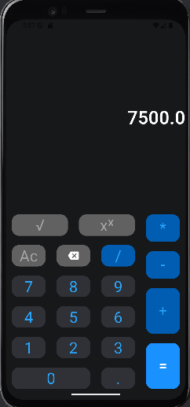

# 🔢 Simple Flutter Calculator

> A lightweight and modern calculator app built with Flutter.  
> It supports basic arithmetic operations with a clean UI and smooth button interactions.

---

## ✨ Features

```text
• Basic operations: +, -, ×, ÷

• Decimal point support

• Power and square root support

• Input correction (AC and backspace)

• Responsive and organized button layout
```


