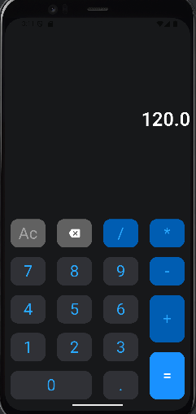

# calculator
# 🔢 Simple Flutter Calculator

> A lightweight and modern calculator app built with Flutter.  
> It supports basic arithmetic operations with a clean UI and smooth button interactions.

---

## ✨ Features

```text
• Basic operations: +, -, ×, ÷

• Decimal point support

• Input correction (AC and backspace)

• Responsive and organized button layout
```

---

## 🛠️ Tech Stack

```text
• Flutter
• Dart
```

---

## 🚀 Getting Started

```bash
git clone https://github.com/your-username/your-repo-name.git
cd your-repo-name

flutter pub get
flutter run
```

---

## 📁 Project Structure

```text
lib/
├── widgets/
│   └── calculator_button.dart   # Reusable button component
└── calculator_screen.dart       # UI layout and logic
```

---



